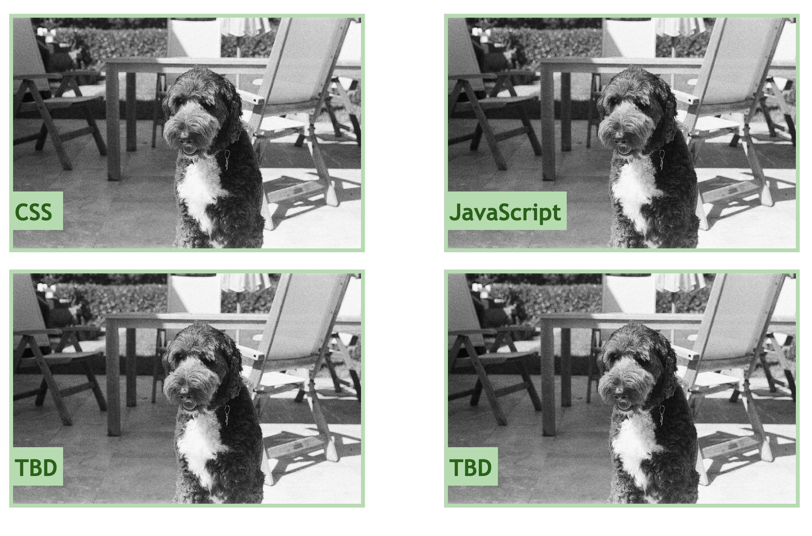

# Challenge2-Portfolio-Creation
Welcome to my "Portfolio" - I hope that I will fill this with many projects as time goes on. 

For now, you can click on "code refactor"; you will be directed to our first homework assignment in class. 

Additionally, please note that I have added photos of my dog, Howard, as a placeholder for projects to come.

You can see this in the image below:

# Resources
I went to office hours and received guidence from Professor Phil Loy.

Here he guided me through the wire frame & then assisted with the Media Query 
